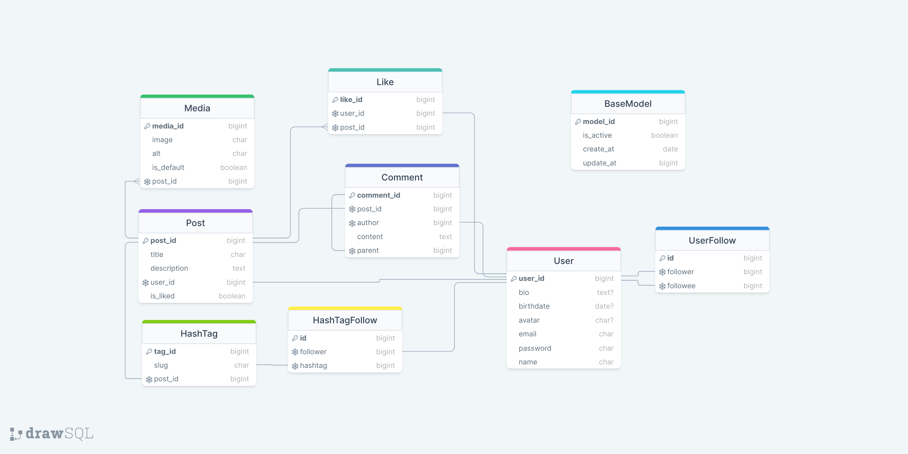

# Social Media

A social media app built with Django.

## Table of Contents

- [Social Media](#social-media)
  - [Table of Contents](#table-of-contents)
  - [Features](#features)
  - [Getting Started](#getting-started)
  - [Built With](#built-with)
  - [Authors](#authors)
  - [License](#license)
  - [Acknowledgements](#acknowledgements)

## Features

- Users can post media and a description
- Users can like and comment on posts
- Users have profiles where they can upload an avatar and see their post history
- Users can follow other users to see their posts

## Getting Started

    Clone the repository: git clone https://github.com/ata-the-legend/Social-media-django.git
    Change into the project directory: cd Social-media-django
    Create a virtual environment: python3 -m venv venv
    Activate the virtual environment:
        Linux/Mac: source venv/bin/activate
        Windows: venv\Scripts\activate
    Install requirements: pip3 install -r requirements.txt
    Apply migrations: python3 manage.py migrate
    Create a superuser: python3 manage.py createsuperuser
    Run the server: python3 manage.py runserver
    The app will be available at 127.0.0.1:8000

## Built With

Python 3
Django
Bootstrap
SQLite (Database) 

## Authors

Ata Safapour
## License

MIT
## Acknowledgements

Daneshkar

